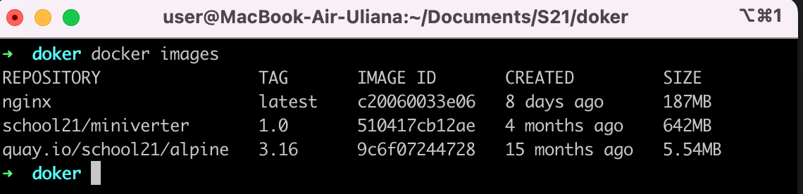
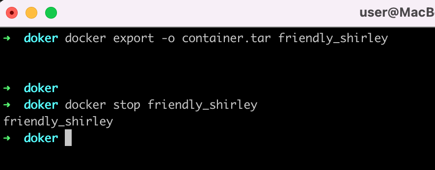
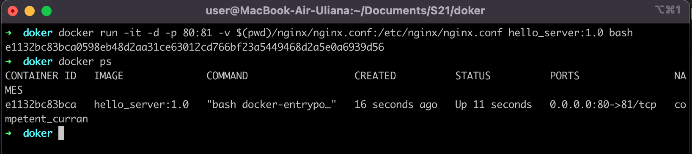

## Part 1. Готовый докер
  - Взять официальный докер образ с nginx и скачать `docker pull`:  
    
  - Проверить наличие докер `docker images`:  
    
  - Запустить докер образ `docker run -d [image_id|repository]` (`-d` запуск в фоновом режиме)
  - Проверить, что образ запустился `docker ps`:  
    
  - Посмотреть информацию о контейнере `docker inspect [container_id|container_name]`: 
    
    - Container size: 186640937 bytes
    - Mapped ports list: 80/tcp
    - Container IP: 172.17.0.2
  - Остановить докер образ `docker stop [container_id|container_name]` 
  - Запустить докер с портами `80` и `443` в контейнере, замапленными на такие же порты на локальной машине, через команду `run`
    
  - Проверить вывод `localhost:80`  
    
  - Перезапустить докер контейнер `docker restart [container_id|container_name]`: 
    

## Part 2. Операции с контейнером
  - Прочитать конфигурационный файл `nginx.conf` внутри докер контейнера: 
    
  - Создать на локальной машине файл `nginx.conf` и настроить в нем по пути `/status` вывод страницы статуса nginx:  
    
  - Скопировать созданный файл `nginx.conf` внутрь образа через команду `docker cp`
  - Перезапустить nginx внутри докера через команду `exec`:  
      
  - Проверить вывод `localhost:80/status`:  
      
    Команда `nginx -s reload` обновляет конфигурацию nginx и применяет изменения в сервере без прерывания его работы.
  - Создать архив контейнера `container.tar` через команду `export`
  - Удалить контейнер:  
    
  - Удалить образ через `docker rmi [image_id|repository]`, не удаляя перед этим контейнеры
  - Удалить остановленный контейнер:  
    
  - Импортировать контейнер через команду `import` и запустить  
  - Проверить, что по адресу `localhost:80/status` отдается страничка со статусом сервера nginx: 
      
    - опция `-c`, позволяет указать команду, которая будет выполняться при запуске контейнера.
    - `"-g"` в данной команде позволяет указать глобальные директивы в конфигурационном файле nginx при запуске контейнера, и `"daemon off;"` используется для того, чтобы nginx работал внутри контейнера и продолжал обрабатывать запросы.

## Part 3. Мини веб-сервер
  - Написать мини сервер на C и FastCgi, который будет возвращать страничку с надписью `Hello World!`
  - Запустить написанный мини сервер через `spawn-fcgi` на порту `8080` (предварительно собрали c флагом `-lfcgi`): 
     
  - Написать свой конфиг `nginx.conf`, который будет перенаправлять все запросы с `81` порта на `127.0.0.1:8080`: 
     
  - Проверить, что в браузере по localhost:81 открывается нужная страничка:
    - копируем конфиг в `/etc/nginx/`
    - добавляем юзера через `useradd nginx`
    - взываем `service nginx restart`  
     

## Part 4. Свой докер
  - Написать свой докер образ, который:
    - собирает исходники мини сервера на FastCgi из Части 3.
    - запускает его на `8080` порту.
    - копирует внутрь образа написанный `./nginx/nginx.conf`.
    - запускает nginx.

  - Собрать докер образ через `docker build` указав имя и тег. Проверить через `docker images`, что все собралось корректно: 
     
    

  - Запустить собранный докер образ с перенаправлением `81` порта на `80` на локальной машине и маппингом папки `./nginx` в контейнер по адресу папки nginx.
  - Проверить, что по localhost:80 доступна страничка написанного мини сервера: 
      
      
    - флаг `-v <путь_на_хосте>:<путь_в_контейнере>` используется для создания точки монтирования (volume) в контейнере. Это позволяет настроить конфигурацию nginx в контейнере, используя файл с хостовой машины.
    - флаг `-it`:
      - `--interactive` (`-i`) создает интерактивное окружение в контейнере, для того, чтобы взаимодействовать с контейнером, отправлять и принимать данные из терминала.
      - `--tty` (`-t`) ассоциирует терминал (TTY - terminal) на локальной машине с STDIN (стандартным входным потоком) внутри контейнера. Это позволяет получать вывод от контейнера в реальном времени и отправлять команды.

## Part 5. Dockle
  - Просканировать образ из предыдущего задания через `dockle [image_id|repository]`: 
    
  - Исправить образ так, чтобы при проверке через dockle не было ошибок и предупреждений: 
    

## Part 6. Базовый Docker Compose
  - Написать файл docker-compose.yml, с помощью которого:
    - Поднять докер контейнер из Части 5 (он должен работать в локальной сети, т.е. не нужно использовать инструкцию EXPOSE и мапить порты на локальную машину).
    - Поднять докер контейнер с nginx, который будет проксировать все запросы с `8080` порта на `81` порт первого контейнера. Замапить `8080` порт второго контейнера на `80` порт локальной машины.
    - Замапить `8080` порт второго контейнера на `80` порт локальной машины  
  
  - Остановить все запущенные контейнеры: 
    

  - Собрать и запустить проект с помощью команд `docker-compose build` и `docker-compose up`: 
   
  - Проверить, что в браузере по `localhost:80` отдается написанная вами страничка, как и ранее:
    